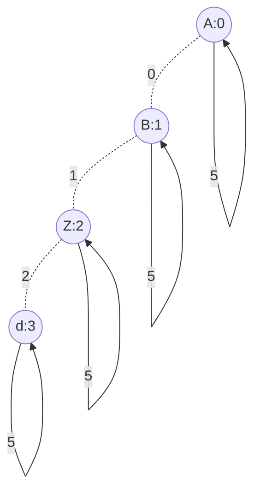

# Large Test

```mermaid
graph TD
    A((A:0))
    B((B:1))
    Z((Z:2))
    d((d:3))

    A -.0.- B
    B -.1.- Z
    Z -.2.- d

    A --1--> A
    A --2--> A
    A --3--> A
    A --4--> A
    A --5--> A
    B --2--> B
    B --3--> B
    B --4--> B
    B --5--> B
    Z --0--> Z
    Z --3--> Z
    Z --4--> Z
    Z --5--> Z
    d --0--> d
    d --1--> d
    d --3--> d
    d --4--> d
    d --5--> d
```
