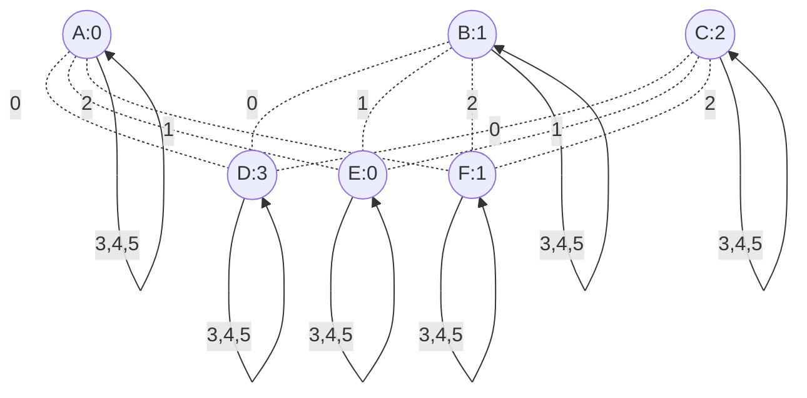

# Six Rooms Bipartite Topology



## Config
```
ROOMS A:0 B:1 C:2 D:3 E:0 F:1
START A

A0 D0
A1 E0
A2 F0
A3 A3
A4 A4
A5 A5

B0 D1
B1 E1
B2 F1
B3 B3
B4 B4
B5 B5

C0 D2
C1 E2
C2 F2
C3 C3
C4 C4
C5 C5

D0 A0
D1 B0
D2 C0
D3 D3
D4 D4
D5 D5

E0 A1
E1 B1
E2 C1
E3 E3
E4 E4
E5 E5

F0 A2
F1 B2
F2 C2
F3 F3
F4 F4
F5 F5
```