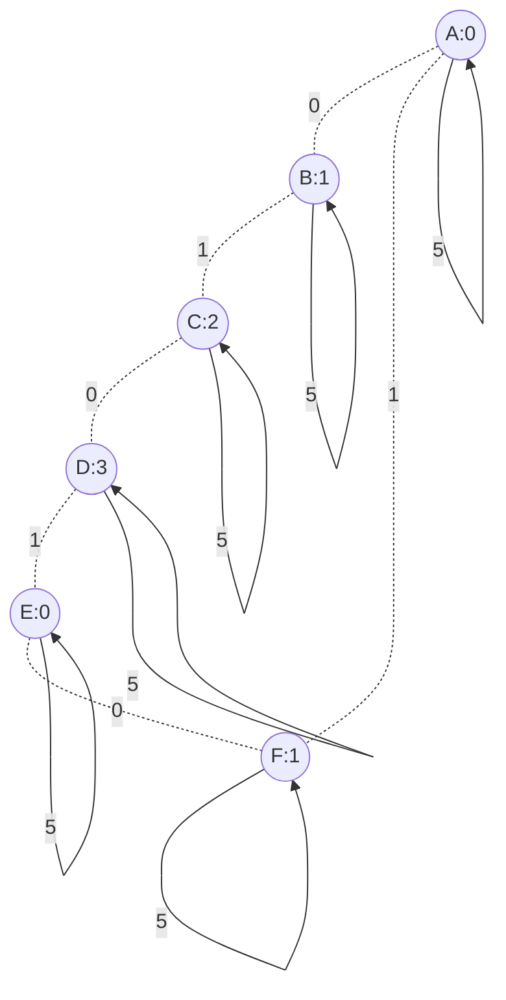

# Six Rooms Circular

```mermaid
graph TD
    A((A:0))
    B((B:1))
    C((C:2))
    D((D:3))
    E((E:0))
    F((F:1))

    A -.0.- B
    A -.1.- F
    B -.1.- C
    C -.0.- D
    D -.1.- E
    E -.0.- F

    A --2--> A
    A --3--> A
    A --4--> A
    A --5--> A
    B --2--> B
    B --3--> B
    B --4--> B
    B --5--> B
    C --2--> C
    C --3--> C
    C --4--> C
    C --5--> C
    D --2--> D
    D --3--> D
    D --4--> D
    D --5--> D
    E --2--> E
    E --3--> E
    E --4--> E
    E --5--> E
    F --2--> F
    F --3--> F
    F --4--> F
    F --5--> F
```
