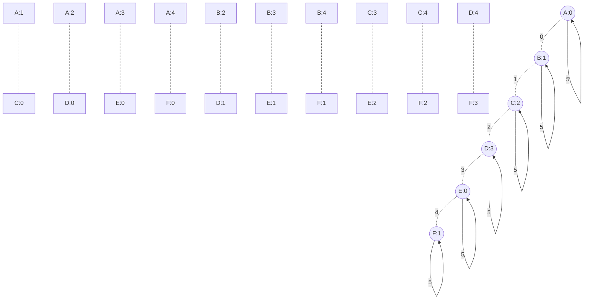

# Six Rooms Fully Connected

```mermaid
graph TD
    A((A:0))
    B((B:1))
    C((C:2))
    D((D:3))
    E((E:0))
    F((F:1))

    A -.0.- B
    A:1 -..- C:0
    A:2 -..- D:0
    A:3 -..- E:0
    A:4 -..- F:0
    B -.1.- C
    B:2 -..- D:1
    B:3 -..- E:1
    B:4 -..- F:1
    C -.2.- D
    C:3 -..- E:2
    C:4 -..- F:2
    D -.3.- E
    D:4 -..- F:3
    E -.4.- F

    A --5--> A
    B --5--> B
    C --5--> C
    D --5--> D
    E --5--> E
    F --5--> F
```
