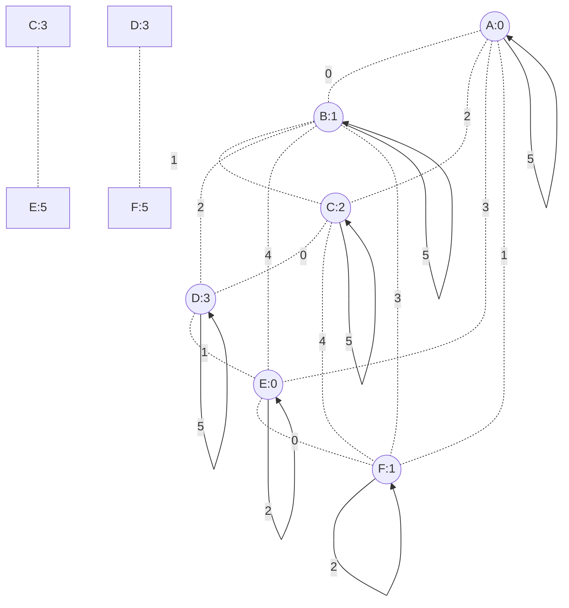

# Six Rooms Interconnected

```mermaid
graph TD
    A((A:0))
    B((B:1))
    C((C:2))
    D((D:3))
    E((E:0))
    F((F:1))

    A -.0.- B
    A -.2.- C
    A -.3.- E
    A -.1.- F
    B -.1.- C
    B -.2.- D
    B -.4.- E
    B -.3.- F
    C -.0.- D
    C:3 -..- E:5
    C -.4.- F
    D -.1.- E
    D:3 -..- F:5
    E -.0.- F

    A --4--> A
    A --5--> A
    B --5--> B
    C --5--> C
    D --4--> D
    D --5--> D
    E --2--> E
    F --2--> F
```
