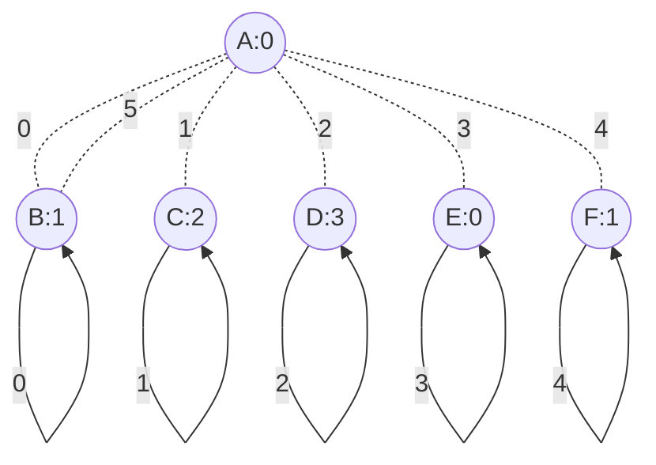

# Six Rooms Mixed Self-Loops



## Config
```
ROOMS A:0 B:1 C:2 D:3 E:0 F:1
START A

A0 B1
A1 C2
A2 D3
A3 E4
A4 F5
A5 B2

B0 B0
B1 A0
B2 A5
B3 C3
B4 D4
B5 E5

C0 C0
C1 C1
C2 A1
C3 B3
C4 D5
C5 F3

D0 D0
D1 D1
D2 D2
D3 A2
D4 B4
D5 C4

E0 E0
E1 E1
E2 E2
E3 E3
E4 A3
E5 B5

F0 F0
F1 F1
F2 F2
F3 F3
F4 F4
F5 A4
```