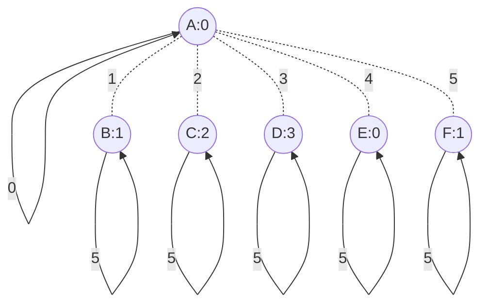

# Six Rooms Star Topology



## Config
```
ROOMS A:0 B:1 C:2 D:3 E:0 F:1
START A

A0 A0
A1 B0
A2 C0
A3 D0
A4 E0
A5 F0

B0 A1
B1 B1
B2 B2
B3 B3
B4 B4
B5 B5

C0 A2
C1 C1
C2 C2
C3 C3
C4 C4
C5 C5

D0 A3
D1 D1
D2 D2
D3 D3
D4 D4
D5 D5

E0 A4
E1 E1
E2 E2
E3 E3
E4 E4
E5 E5

F0 A5
F1 F1
F2 F2
F3 F3
F4 F4
F5 F5
```