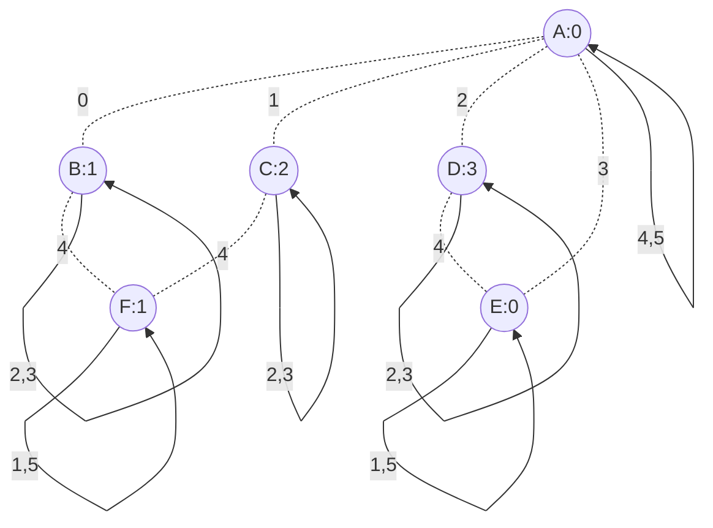

# Six Rooms Two Self-Loops Each



## Config
```
ROOMS A:0 B:1 C:2 D:3 E:0 F:1
START A

A0 B0
A1 C0
A2 D0
A3 E0
A4 A4
A5 A5

B0 A0
B1 C1
B2 B2
B3 B3
B4 F0
B5 D1

C0 A1
C1 B1
C2 C2
C3 C3
C4 F2
C5 E2

D0 A2
D1 B5
D2 D2
D3 D3
D4 E3
D5 F3

E0 A3
E1 E1
E2 C5
E3 D4
E4 F4
E5 E5

F0 B4
F1 F1
F2 C4
F3 D5
F4 E4
F5 F5
```