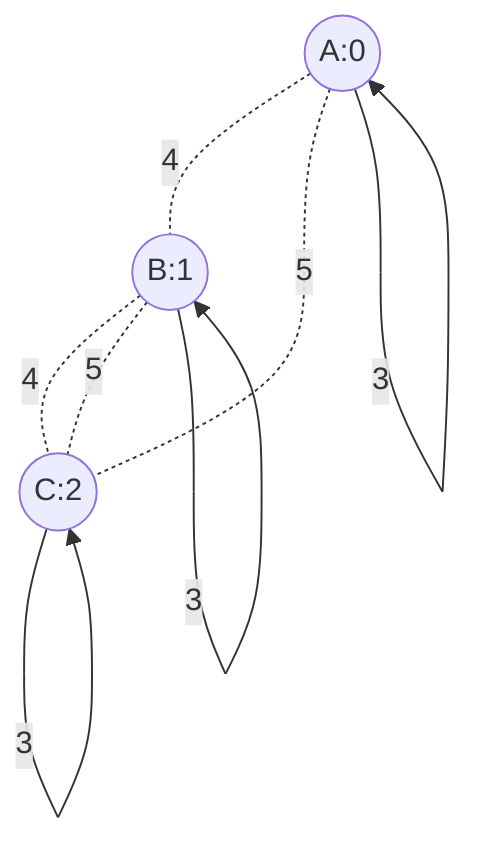

# Three Rooms Four Self-Loops Each


```mermaid
graph TD
    A((A:0))
    B((B:1))
    C((C:2))
    
    A -.4.- B
    A -.5.- C
    B -.4.- C
    B -.5.- C
    
    A --0--> A
    A --1--> A
    A --2--> A
    A --3--> A
    B --0--> B
    B --1--> B
    B --2--> B
    B --3--> B
    C --0--> C
    C --1--> C
    C --2--> C
    C --3--> C
```

## Config
```
ROOMS A:0 B:1 C:2
START A

A0 A0
A1 A1
A2 A2
A3 A3
A4 B4
A5 C4

B0 B0
B1 B1
B2 B2
B3 B3
B4 A4
B5 C5

C0 C0
C1 C1
C2 C2
C3 C3
C4 A5
C5 B5
```