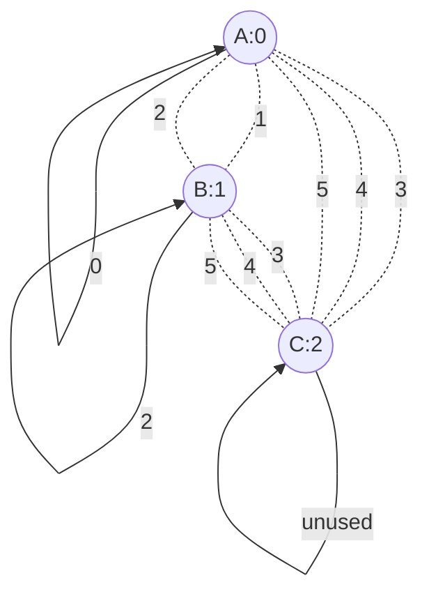

# Three Rooms One Self-Loop Each


```mermaid
graph TD
    A((A:0))
    B((B:1))
    C((C:2))
    
    A -.1.- B
    A -.2.- B
    A -.3.- C
    A -.4.- C
    A -.5.- C
    B -.3.- C
    B -.4.- C
    B -.5.- C
    
    A --0--> A
    B --2--> B
    C --unused--> C
```

## Config
```
ROOMS A:0 B:1 C:2
START A

A0 A0
A1 B0
A2 B1
A3 C0
A4 C1
A5 C2

B0 A1
B1 A2
B2 B2
B3 C3
B4 C4
B5 C5

C0 A3
C1 A4
C2 A5
C3 B3
C4 B4
C5 B5
```