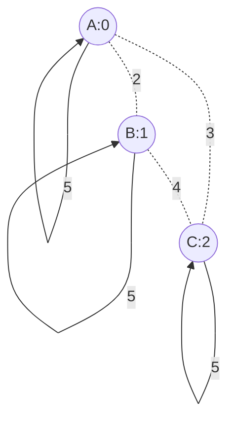

# Three Rooms Two Loops

```mermaid
graph TD
    A((A:0))
    B((B:1))
    C((C:2))

    A -.2.- B
    A -.3.- C
    B -.4.- C

    A --0--> A
    A --1--> A
    A --4--> A
    A --5--> A
    B --0--> B
    B --1--> B
    B --3--> B
    B --5--> B
    C --0--> C
    C --1--> C
    C --2--> C
    C --5--> C
```
