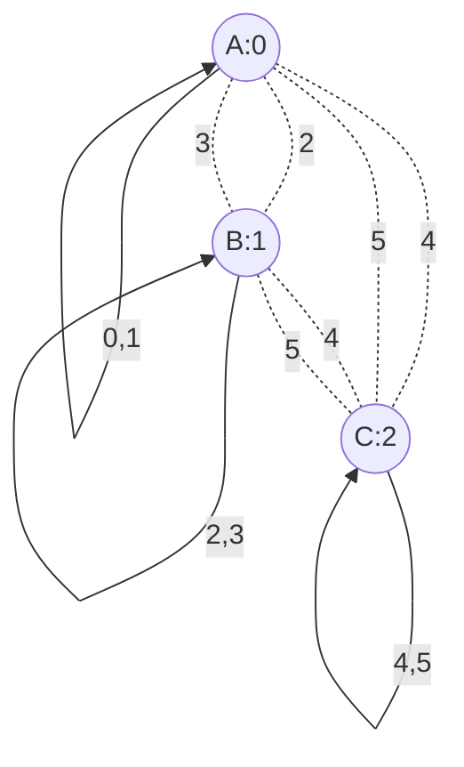

# Three Rooms Two Self-Loops Each


```mermaid
graph TD
    A((A:0))
    B((B:1))
    C((C:2))
    
    A -.2.- B
    A -.3.- B
    A -.4.- C
    A -.5.- C
    B -.4.- C
    B -.5.- C
    
    A --0,1--> A
    B --2,3--> B
    C --4,5--> C
```

## Config
```
ROOMS A:0 B:1 C:2
START A

A0 A0
A1 A1
A2 B0
A3 B1
A4 C0
A5 C1

B0 A2
B1 A3
B2 B2
B3 B3
B4 C2
B5 C3

C0 A4
C1 A5
C2 B4
C3 B5
C4 C4
C5 C5
```