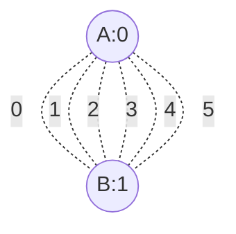

# Two Rooms Fully Connected


```mermaid
graph TD
    A((A:0))
    B((B:1))
    
    A -.0.- B
    A -.1.- B
    A -.2.- B
    A -.3.- B
    A -.4.- B
    A -.5.- B
```

## Config
```
ROOMS A:0 B:1
START A

A0 B0
A1 B1
A2 B2
A3 B3
A4 B4
A5 B5
```