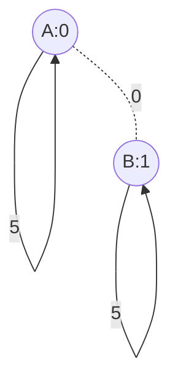

# Two Rooms Single

```mermaid
graph TD
    A((A:0))
    B((B:1))

    A -.0.- B

    A --1--> A
    A --2--> A
    A --3--> A
    A --4--> A
    A --5--> A
    B --1--> B
    B --2--> B
    B --3--> B
    B --4--> B
    B --5--> B
```
