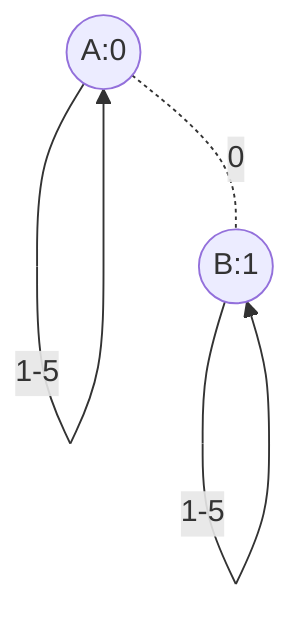

# Two Rooms Single Connection


```mermaid
graph TD
    A((A:0))
    B((B:1))
    
    A -.0.- B
    A --1-5--> A
    B --1-5--> B
```

## Config
```
ROOMS A:0 B:1
START A

A0 B0
A1 A1
A2 A2
A3 A3
A4 A4
A5 A5
B1 B1
B2 B2
B3 B3
B4 B4
B5 B5
```